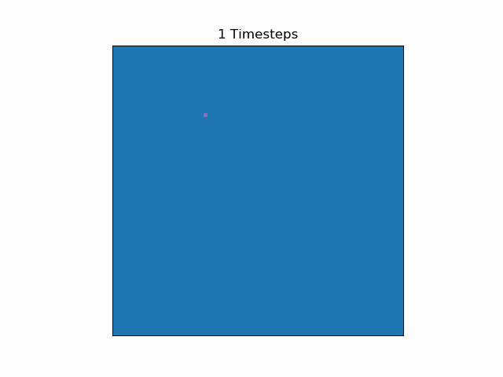

# Airborne Auto
A Cellular Automata for Airborne Diseases/一个空气传播传染病的元胞自动机模拟器    
元胞自动机模拟是对每个个体的仿真，不同于基于数据的曲线拟合。可以获得个体具体活动与疾病传播的关系。

## Requirement(s)/依赖
`matplotlib`

## How To Use/使用方法
...

## Todos/待实现
### Statistics/统计输出
在元胞演化的同时进行记录统计数据。

### Individual Tracking/个体追踪
记录每个个体的病程。

### CLI Support/命令行支持
通过命令行调整参数、选择保存/显示方式。

### Outdoor Activity Model/户外活动模型
每个人外出到不同距离位置的概率不同。

### Partitioning/人群分块
按家庭、社区分块。
    

